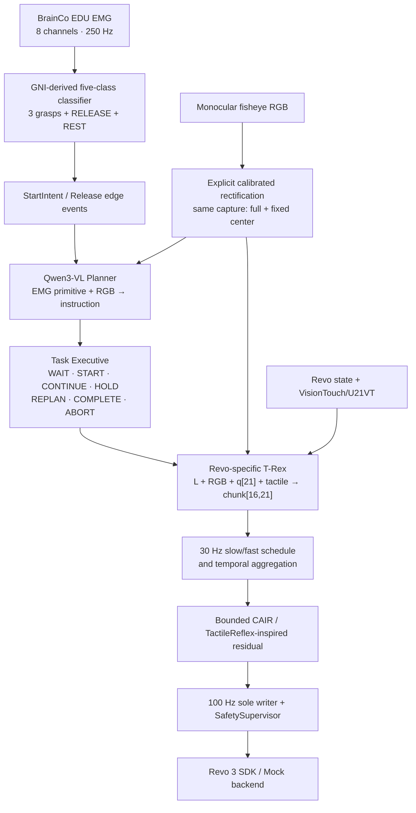

<div align="center">

# T-Rex × Revo 3 V1

### EMG–RGB Task Planning · Tactile-Reactive VLA · Safe 21-DoF Revo 3 Runtime

[](https://www.python.org/)
[](https://pytorch.org/)
[](audit/README.md)
[](LICENSE)

[中文](README.md) · [Detailed V1 documentation (Chinese)](docs/revo3_v1/README.md) · [Data collection guide (Chinese)](teleop_data_collection/README.md) · [Audit evidence](audit/README.md) · [Upstream T-Rex](https://github.com/ZhuoyangLiu2005/T-Rex)

</div>

> [!IMPORTANT]
> This repository is an experimental Revo 3 adaptation of upstream **T-Rex**, not an official Revo 3 release from the original authors. Its current status is strictly **component-verified**: mock integration, interfaces, safety boundaries, and bounded official-weight GPU smoke tests have passed. Real Revo 3/U21VT/amputee closed-loop validation is still pending; no physical task, functional, or clinical claim is made.

---

## Overview

This project builds the V1 software path for assistive human–robot collaboration with the **BrainCo Revo 3 single 21-DoF dexterous hand**. EMG supplies a high-level intent primitive, monocular RGB completes the target and scene semantics, and a Qwen3-VL planner produces a normalized language instruction. The downstream Revo-specific T-Rex policy receives only language, RGB, continuous hand state, and tactile observations, then predicts 21-D hand actions. Commands reach the hand only after a bounded tactile residual, a 100 Hz sole writer, and final safety authorization.

Core design decisions:

- **EMG never enters the VLA embedding or VLA training sample.** It is restricted to grasp/release primitives and edge events.
- **The VLM planner is the main path.** EMG specifies how to grasp; RGB supplies what and where; fixed templates are an ablation only.
- **One Task Executive owns all task state.** Start, continue, hold, replan, completion, and abort are not distributed across competing gates.
- **Tactile control is layered.** T-Rex produces semantic nominal motion and medium-rate tactile refinement; the CAIR/TactileReflex-inspired plugin contributes only a bounded residual; the safety layer has final veto authority.
- **Robot training data is physically separated from EMG.** The VLA projection contains robot-side RGB, Revo state, exact controller-sent action targets, and tactile data only.

## Architecture



There is no SAM, object detector, or instance tracker in the main visual path. The camera layer performs only explicitly calibrated fisheye rectification. The planner receives a full view and a fixed-center view from the same capture and returns a strict structured target box. Readiness is decided from provenance, timestamps, scene signatures, and structured-decision stability rather than another visual model.

## Frozen V1 tasks

| CLI task | Primitive | Normalized task | Hand-only boundary |
|---|---|---|---|
| `bottle` | `POWER_GRASP` | Grasp and securely hold the centered bottle | Grasp/hold only |
| `phone` | `PRECISION_GRASP` | Precisely grasp and hold the centered phone | Grasp/hold only |
| `plastic_bag` | `PRECISION_GRASP` | Grasp and hold the bag handles | User arm performs lifting |
| `refrigerator_door` | `LATERAL_GRASP` | Laterally grasp and hold the door handle | User arm pulls the door |

The user is not required to maintain muscle contraction until task completion. A confirmed grasp intent is latched by the system; `REST/UNKNOWN` does not cancel an active task. A stable `RELEASE` initiates deterministic controlled opening, but EMG can never override collision, over-current, stale-state, hard tactile overload, invalid lease, or emergency-stop checks.

## Implemented components

| Subsystem | Current implementation |
|---|---|
| EMG | 8ch@250 Hz five-class GNI-derived classifier, confidence/margin/quality/dwell logic, streaming Start/Release events, subject-exclusive synthetic fixture and trainer |
| Planner | Strict Qwen3-VL-2B JSON, three full frames plus same-capture center, Ask-to-Clarify, LoRA artifact validation, 20 s SLA, scene-stability recheck |
| Task Executive | Single authoritative state machine, task/version/lease latching, 150 ms atomic commit, one pre-contact replan, explicit terminal acknowledgment |
| T-Rex adaptation | Continuous `q[21]`, absolute `chunk[16,21]`, 30 Hz, slow/fast refinement at offsets `0/4/8/12`, temporal aggregation |
| Tactile profiles | Profile A: 16 native Force6D frames + current five-finger DIFF; Profile B: DIFF-only; Profile C blocked by default |
| Control and safety | Independent 30 Hz control and 100 Hz sole-writer loops, bounded CAIR residual, joint/velocity/acceleration/current/collision/freshness checks, confirmed SoftStop |
| Model identity | Server-owned checkpoint, lineage, normalization, profile, and joint-order identity; handshake and per-reply verification |
| Data collection | Native-rate glove/EMG/camera/Tianji/Revo/touch recording, causal 30 Hz projection, physical VLA/EMG separation, exact-sent action labels |
| Hardware boundaries | Fail-closed clients/adapters for BrainCo EDU EMG/glove, Revo3 SDK, VisionTouch Force6D, fisheye camera, and generic Tianji integration; field integration pending |

### Frozen runtime parameters

- Planner: `Qwen/Qwen3-VL-2B-Instruct@89644892...`, production `max_new_tokens=384`; 128 tokens are smoke/ablation only.
- EMG: 8 channels, 250 Hz, 2 s/500-sample window, approximately 50 ms update; 300 ms grasp dwell and 500 ms release dwell.
- Policy: 30 Hz, chunk length 16 (~0.533 s), `slow_and_fast@0`, `fast@4/8/12`.
- Writer: 100 Hz; 100 ms control watchdog; 50 ms servo-input timeout; 1000 ms IO-close timeout.
- Action semantics: absolute 21-D joint targets. Internal code uses radians/SI; vendor units are converted only at adapter boundaries.

## Quick start

### 1. Environment

```bash
conda create -n trex-revo3 python=3.10 -y
conda activate trex-revo3

pip install torch==2.6.0 torchvision==0.21.0 \
  --index-url https://download.pytorch.org/whl/cu124
pip install -e .
```

Run every command from the repository root. On Windows, `py -3.10` can replace `python`.

### 2. Run the four-task integrated simulation

```powershell
py -3.10 scripts/revo3_v1_runtime.py `
  --mode simulation `
  --task all `
  --servo-ticks 120
```

The command uses the same double-rate runtime, Task Executive, policy runner, servo, and safety boundaries as production, with deterministic simulated inputs/backends. A passing run contains `START`, policy `READY`, non-zero authorized writes, explicit release, and `shutdown_clean=true` for all four tasks. It proves software plumbing only, not physical task success.

### 3. Generate and train the synthetic EMG fixture

```powershell
py -3.10 scripts/revo3_v1_generate_emg.py `
  --output outputs/emg_synthetic `
  --preset smoke

py -3.10 scripts/revo3_v1_train_emg.py `
  --dataset outputs/emg_synthetic `
  --output outputs/emg_smoke_run `
  --from-scratch-ablation `
  --allow-window-reset-fallback `
  --preset smoke `
  --epochs 3
```

This is a synthetic five-class data/training smoke test and provides no evidence of real-user EMG generalization. The legacy OPEN/CLOSE binary path requires explicit `--fixture-binary`.

### 4. Tests

```powershell
py -3.10 -m pytest -q tests/revo3_v1
py -3.10 -m pytest -q teleop_data_collection/tests
py -3.10 -m pytest -q
```

Current results: Revo3 `289 passed`, data collection `137 passed`, full repository `426 passed`. The two warnings are dependency deprecation warnings, not test failures.

## Revo-specific training and inference

The recommended path starts from the official tactile-free pretrain, rebuilds all Revo-bound state/action/tactile/DIFF/VQ branches, and follows `W0 → W1 → Revo midtrain-like → SFT`. The official 62-D bimanual midtrain is an embodiment-transfer ablation only; **slicing or padding it into the 21-D main path is forbidden**.

```bash
hf download miniFranka/T-Rex_pretrain_mecka22k_epoch1 \
  --local-dir /checkpoints/trex_pretrain

hf download Qwen/Qwen3-VL-2B-Instruct \
  --revision 89644892e4d85e24eaac8bacfd4f463576704203 \
  --local-dir /checkpoints/qwen3-vl-2b-8964489
```

The audited launcher is dry-run by default. This is the W0 command skeleton; real execution also requires data and artifacts that pass readiness, replay, split, normalization, and tactile-profile checks:

```bash
python scripts/revo3_v1_trex.py train \
  --base-model /checkpoints/qwen3-vl-2b-8964489 \
  --checkpoint /checkpoints/trex_pretrain/checkpoint-0-610000 \
  --checkpoint-id miniFranka/T-Rex_pretrain_mecka22k_epoch1 \
  --resume-kind official_pretrain \
  --stage w0 \
  --data-json /data/revo3/revo3_trex_train.json \
  --conversion-manifest /data/revo3/revo3_trex_train_manifest.json \
  --readiness-manifest /data/revo3/revo3_vla_readiness.json \
  --development-data-json /data/revo3/revo3_trex_development.json \
  --development-conversion-manifest /data/revo3/revo3_trex_development_manifest.json \
  --development-readiness-manifest /data/revo3/revo3_vla_development_readiness.json \
  --tactile-profile profile_a_force6d_diff \
  --tactile-profile-manifest /data/revo3/tactile_profile.json \
  --output-dir /runs/revo3 \
  --run-name revo3_v1 \
  --num-processes 1
```

Only an explicit `--execute` starts training after command review. Normalization, Revo VQ, and the DIFF encoder are fitted from `MIDTRAIN_TRAIN` only; SFT/development/locked-test conversion must reuse the same frozen artifacts.

The Revo checkpoint server is also dry-run by default:

```bash
python scripts/revo3_v1_trex.py serve \
  --base-model /checkpoints/qwen3-vl-2b-8964489 \
  --checkpoint /runs/revo3/revo3_v1/checkpoint-X-Y \
  --stats-path /data/revo3/revo3_trex_midtrain_train_statistics.json \
  --stats-artifact-path /data/revo3/revo3_trex_midtrain_train_statistics_artifact.json \
  --identity-manifest-out /data/revo3/revo3_trex_server_identity.json \
  --cuda 0 \
  --port 5555
```

Fail-closed production assembly validation:

```bash
python scripts/revo3_v1_runtime.py \
  --mode production \
  --control-config config/revo3_v1_control.json \
  --runtime-config /data/revo3/runtime.production.json \
  --bindings-factory my_hardware.bindings:build_bindings \
  --validate-only
```

Production runs continuously when `--servo-ticks` is omitted. SIGINT/SIGTERM and supervisor shutdown follow the same cancellation, confirmed SoftStop, and bounded planner/policy/backend/IO close path. An unconfirmed stop or incomplete close is never reported as clean.

See the [detailed V1 documentation](docs/revo3_v1/README.md) and [training-data audit](docs/revo3_v1/TRAINING_DATA_AUDIT.md) for the complete data contract, stage hyperparameters, and artifact lineage.

## Teleoperation data collection and hardware integration

[`teleop_data_collection/`](teleop_data_collection/) provides:

- source/backend boundaries for BrainCo EDU EMG, BrainCo EDU glove, MANUS, RGB/fisheye cameras, Revo3/U21VT/VisionTouch, and Tianji;
- native-rate recording and causal 30 Hz `latest-not-after` anchors;
- injectable glove→Revo and 6DoF wrist→Tianji retargeting/IK interfaces;
- `requested → authorized → exact_sent` receipts, where only a successfully written exact-sent nominal target may become a VLA action label;
- allowlist-based physical separation from the master episode into Revo VLA and EMG-classification datasets;
- hardware-write-off defaults, SDK/plugin hash checks, capability/arming/watchdog/SoftStop checks, atomic publication, and quarantine.

Field integration still requires device identities, joint order/limits, five U21VT serial numbers and Force6D models, camera K/D/new_K, the current Tianji SDK/ABI, a verified 6DoF wrist source, URDF/tool/payload parameters, physical E-stop, and bench approval. Example configurations are intentionally non-executable.

## Repository layout

```text
revo3_v1/                 EMG, planner, executive, policy, runtime, safety, data contracts
scripts/                  EMG, training, serving, runtime, and conversion entry points
config/                   Frozen control/T-Rex configuration and production/hardware schemas
teleop_data_collection/   Teleoperation, native multimodal recording, hardware boundaries, export
docs/revo3_v1/            Detailed V1 design and training-data audit
audit/                    Reproduction evidence, GPU smoke, matrices, readiness, claim boundaries
qwen_vla/                 Upstream/adapted Qwen VLA model code
tactile_vqvae/            Tactile tokenizer/VQ-VAE
tests/                    Revo3 V1 tests
```

## Evidence and limitations

| Area | Verified | Not implied |
|---|---|---|
| Local integration | Four-task mock runtime, dual-rate scheduling, state machine, authorized writes, release, clean shutdown | Physical grasp success |
| Qwen GPU smoke | Pinned revision generated schema-valid `ASK_CLARIFY`; observed peak ~4540 MiB | Real grounding or planner accuracy |
| Official T-Rex GPU smoke | Official midtrain full-tactile `slow_and_fast` returned finite `[16,62]`; peak ~8674 MiB | Revo `[16,21]` checkpoint compatibility |
| Data/safety | Causal alignment, exact-sent provenance, split/normalization lineage, fail-closed tests | Training approval or user safety |
| Hardware code | Injected/fake-client and static SDK-boundary checks | Validated hardware, firmware, latency, or E-stop behavior |

See [`audit/README.md`](audit/README.md) and [`audit/revo3_v1_plan_alignment_20260818.md`](audit/revo3_v1_plan_alignment_20260818.md) for the exact evidence boundary.

---

## Upstream T-Rex

This fork retains and adapts the original T-Rex implementation. Please consult and cite the upstream work for the original 100-hour tactile-reactive dataset, asynchronous mixture-of-transformers architecture, temporal tactile VQ-VAE, 12-task experiments, and paper-level claims.

- [Upstream repository](https://github.com/ZhuoyangLiu2005/T-Rex)
- [Project page](https://tactile-reactive-dexterous.github.io/)
- [Paper](https://arxiv.org/abs/2606.17055)
- [Dataset](https://huggingface.co/datasets/zekaiwang/trex_dataset)
- [Official pretrain](https://huggingface.co/miniFranka/T-Rex_pretrain_mecka22k_epoch1)
- [Official midtrain](https://huggingface.co/miniFranka/T-Rex_midtrain_mecka23k_ucb100_vqvae_epoch6)

## License

The repository is released under the [MIT License](LICENSE). Optional hardware SDKs, downloaded models, datasets, and external source trees remain subject to their own licenses and redistribution terms.

## Citation

If this repository is useful, cite the original T-Rex paper and clearly describe this Revo 3 integration as an experimental fork rather than an upstream result.

```bibtex
@misc{trex2026,
  title         = {T-Rex: Tactile-Reactive Dexterous Manipulation},
  author        = {Dantong Niu and Zhuoyang Liu and Zekai Wang and Boning Shao and Zhao-Heng Yin and Anirudh Pai and Yuvan Sharma and Stefano Saravalle and Ruijie Zheng and Jing Wang and Ryan Punamiya and Mengda Xu and Yuqi Xie and Yunfan Jiang and Letian Fu and Konstantinos Kallidromitis and Matteo Gioia and Junyi Zhang and Jiaxin Ge and Haiwen Feng and Fabio Galasso and Wei Zhan and David M. Chan and Yutong Bai and Roei Herzig and Jiahui Lei and Fei-Fei Li and Ken Goldberg and Jitendra Malik and Pieter Abbeel and Yuke Zhu and Danfei Xu and Jim Fan and Trevor Darrell},
  year          = {2026},
  eprint        = {2606.17055},
  archivePrefix = {arXiv},
  primaryClass  = {cs.RO},
  url           = {https://arxiv.org/abs/2606.17055}
}
```
